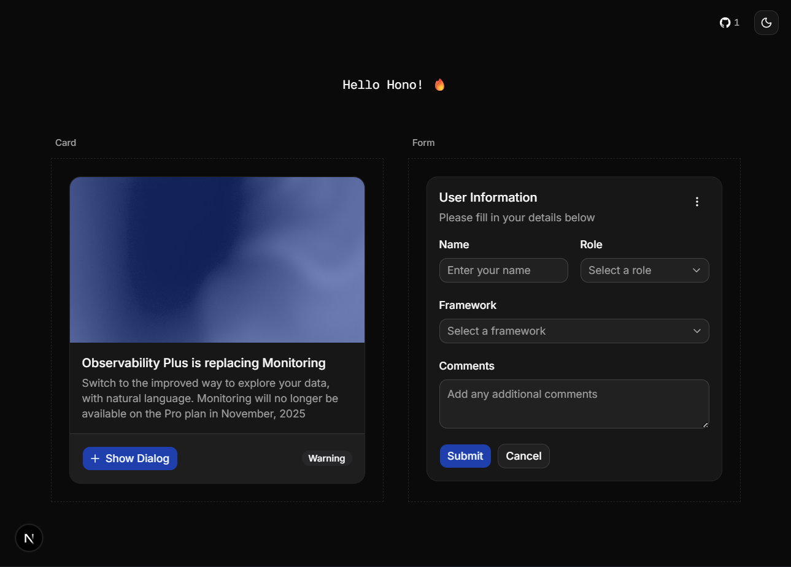

# 🚀 turbo_next_hono_starter

A modern, full-stack monorepo starter template powered by **Turborepo**, **Next.js**, **Hono**, **Bun**, and **ShadCN UI**.


## 📸 Preview

<p align="center">
  
</p>

---

## ✨ Features

- ⚡ **Turborepo** - High-performance monorepo build system with caching
- 🌐 **Next.js 16** - React framework for production with App Router
- 🔥 **Hono** - Ultrafast, lightweight web framework for the API
- 🍞 **Bun** - All-in-one JavaScript runtime & package manager
- 🎨 **ShadCN UI** - Beautiful, accessible React components
- 📦 **Shared Packages** - Reusable UI components and configs
- 🔒 **TypeScript** - Full type safety across the entire stack
- 🎯 **ESLint + Prettier** - Code quality and formatting

---

## 📁 Project Structure

```
turbo_next_hono_starter/
├── apps/
│   ├── web/              # Next.js frontend (port 3001)
│   └── api/              # Hono API backend (port 3000)
├── packages/
│   ├── ui/               # Shared React component library
│   ├── eslint-config/    # Shared ESLint configurations
│   └── typescript-config/# Shared TypeScript configurations
├── package.json
├── turbo.json
└── README.md
```

---

## 🚀 Getting Started

### Prerequisites

- [Bun](https://bun.sh/) (v1.0+)
- [Node.js](https://nodejs.org/) (v18+)

### Installation

```bash
# Clone the repository
git clone https://github.com/vishkx/turbo_next_hono_starter.git
cd turbo_next_hono_starter

# Install dependencies
bun install
```

### Development

```bash
# Run all apps in development mode
bun dev

# Or run specific apps
bun dev --filter=web   # Frontend only
bun dev --filter=api   # API only
```

| App | URL |
|-----|-----|
| 🌐 Web (Next.js) | http://localhost:3001 |
| 🔥 API (Hono) | http://localhost:3000 |

### Build

```bash
# Build all apps and packages
bun run build

# Build specific app
bun run build --filter=web
```

---

## 🛠️ Tech Stack

| Layer | Technology | Description |
|-------|------------|-------------|
| **Monorepo** | Turborepo | Build orchestration & caching |
| **Frontend** | Next.js 16 | React framework with App Router |
| **Backend** | Hono | Ultrafast web framework |
| **Runtime** | Bun | JavaScript runtime & bundler |
| **UI** | ShadCN UI | Accessible component library |
| **Styling** | Tailwind CSS | Utility-first CSS framework |
| **Language** | TypeScript | Type-safe JavaScript |

---

## 📦 Apps & Packages

### Apps

- **`apps/web`** - Next.js frontend application
  - ShadCN UI components
  - Tailwind CSS styling
  - App Router with layouts

- **`apps/api`** - Hono backend API
  - RESTful API endpoints
  - CORS configured
  - Hot reload with Bun

### Packages

- **`@repo/ui`** - Shared React component library
- **`@repo/eslint-config`** - ESLint configurations
- **`@repo/typescript-config`** - TypeScript configurations

---

## 🔧 Configuration

### Environment Variables

Create `.env.local` files in respective apps:

```bash
# apps/web/.env.local
NEXT_PUBLIC_API_URL=http://localhost:3000

# apps/api/.env.local
PORT=3000
```

### Ports

| App | Default Port |
|-----|--------------|
| Web | 3001 |
| API | 3000 |

---

## 📝 Scripts

| Command | Description |
|---------|-------------|
| `bun dev` | Start all apps in development mode |
| `bun run build` | Build all apps and packages |
| `bun run lint` | Lint all apps and packages |
| `bun run format` | Format code with Prettier |
| `bun run check-types` | Type-check all packages |

---

## 🤝 Contributing

1. Fork the repository
2. Create your feature branch (`git checkout -b feature/amazing-feature`)
3. Commit your changes (`git commit -m 'Add some amazing feature'`)
4. Push to the branch (`git push origin feature/amazing-feature`)
5. Open a Pull Request

---

## 📄 License

This project is licensed under the MIT License - see the [LICENSE](LICENSE) file for details.

---

## 🔗 Useful Links

- [Turborepo Documentation](https://turborepo.com/docs)
- [Next.js Documentation](https://nextjs.org/docs)
- [Hono Documentation](https://hono.dev/)
- [Bun Documentation](https://bun.sh/docs)
- [ShadCN UI Documentation](https://ui.shadcn.com/)

---

<p align="center">
  Made with ❤️ using Turborepo + Next.js + Hono + Bun + ShadCN
</p>
