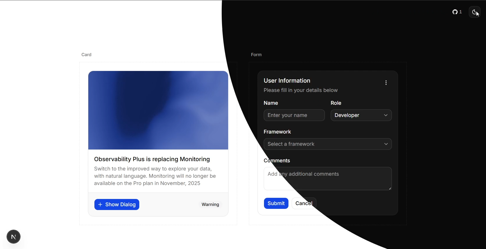

## Next.js 16 + shadcn/ui Starter

<p align="center">
  
  &nbsp;&nbsp;
  
</p>

<p align="center">
  <a href="https://nextjs.org">
    
  </a>
  <a href="https://react.dev">
    
  </a>
  <a href="https://tailwindcss.com">
    
  </a>
  <a href="https://ui.shadcn.com">
    
  </a>
</p>

<p align="center">
  <a href="https://nodejs.org">
    
  </a>
  
  
</p>

This repo is a modern starter template built with **Next.js 16 (App Router)** and **shadcn/ui**, pre‑configured with theming, layout, and a collection of reusable UI components.

It’s intended to be a solid base for new projects so you can focus on building features instead of wiring up the same boilerplate every time.

---

## Preview

<p align="center">
  
</p>

---

## Tech Stack

- **Framework**: [Next.js](https://nextjs.org) (App Router, `src/app` structure)
- **Language**: TypeScript
- **Styling**: [Tailwind CSS](https://tailwindcss.com)
- **UI Library**: [shadcn/ui](https://ui.shadcn.com)
- **Icons & Theme**:
  - `AnimatedThemeToggler` for light/dark mode
  - `@/components/custom/icons` for app icons
- **State / Context**: Global providers via `src/context/providers.tsx`
- **Fonts**: [Geist](https://vercel.com/font) + [Inter](https://fonts.google.com/specimen/Inter) using `next/font`

---

## Features

- **App Router layout** with:
  - Global `RootLayout` in `src/app/layout.tsx`
  - Nested application layout in `src/app/(app)/layout.tsx` with:
    - `GitHubLink` component
    - `AnimatedThemeToggler`
- **Dark/Light mode** support (using CSS variables + Tailwind)
- **Pre‑installed shadcn/ui components** in `src/components/ui` (button, dialog, form, inputs, table, etc.)
- **Custom components** in `src/components/custom`:
  - `animated-theme-toggler`
  - `github-link`
  - `icons`
  - `shad-tooltip`
- **Config driven metadata** via `src/lib/config.ts` (`siteConfig`, theme colors)

You can start customizing the main page in `src/app/(app)/page.tsx`.

---

## Getting Started

Install dependencies:

```bash
npm install
# or
pnpm install
# or
yarn install
# or
bun install
```

Run the development server:

```bash
npm run dev
# or
pnpm dev
# or
yarn dev
# or
bun dev
```

Then open `http://localhost:3000` in your browser.

The primary application layout is under `src/app/(app)`, and the default home page is `src/app/(app)/page.tsx`.

---

## Available Scripts

In addition to `dev`, the following scripts are typically available (see `package.json` for the exact list):

- **`build`**: Create an optimized production build.
- **`start`**: Start the production server (after `build`).
- **`lint`**: Run ESLint over the codebase.

Run any script with:

```bash
npm run <script>
```

---

## Project Structure

High‑level structure (simplified):

- **`src/app`**
  - `layout.tsx` – root layout, fonts, `Providers`, metadata from `siteConfig`
  - `(app)/layout.tsx` – app‑level layout with header (GitHub link + theme toggle)
  - `(app)/page.tsx` – main application page
  - `globals.css` – Tailwind + global styles
- **`src/components`**
  - `custom/` – custom components (`animated-theme-toggler`, `github-link`, `icons`, `shad-tooltip`, etc.)
  - `ui/` – shadcn/ui components (accordion, alert, button, dialog, form controls, etc.)
- **`src/context`**
  - `providers.tsx` – wraps the app with required React providers
- **`src/lib`**
  - `config.ts` – `siteConfig`, theme colors, external links (e.g. GitHub repo)
  - `utils.ts` – helper utilities

---

## Customization Guide

- **Site metadata**: Update `title` and `description` in `src/lib/config.ts`:
  - These values are wired into `metadata` in `src/app/layout.tsx`.
- **GitHub links**: Adjust repo URLs in `src/lib/config.ts` under `siteConfig.links`.
- **Theme colors**: Change `META_THEME_COLORS` in `src/lib/config.ts` and update Tailwind/theme tokens if needed.
- **UI components**: Add or remove shadcn/ui components in `src/components/ui`. You can follow the shadcn/ui docs for usage patterns.
- **Layout**: Customize the main layout in `src/app/(app)/layout.tsx` (e.g., header, footer, page containers).

---

## Deployment

This is a standard Next.js app and can be deployed to any platform that supports Next.js, such as:

- Vercel
- Netlify
- Docker / your own infrastructure

For platform‑specific instructions, follow the [official Next.js deployment documentation](https://nextjs.org/docs/app/building-your-application/deploying).

---

## Credits

Created and maintained by [vishkx](https://github.com/vishkx).  
Original template repo: [`vishkx/nextjs16_shadcn_template`](https://github.com/vishkx/nextjs16_shadcn_template).

---

## Community & Policies

- **Code of Conduct**: By participating in this project, you agree to follow the guidelines in [`CODE_OF_CONDUCT.md`](./CODE_OF_CONDUCT.md).
- **License**: This template is licensed under the **MIT License**. See [`LICENSE`](./LICENSE) for details.

